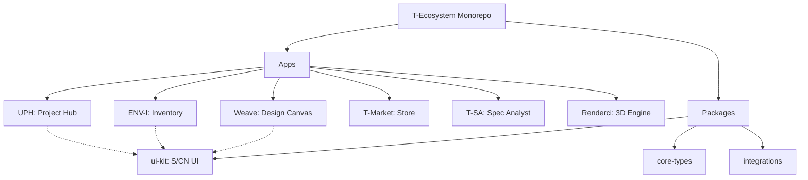

# T-Ecosystem: Master Monorepo

  

**T-Ecosystem** is the unified engineering and operations platform for technical enterprises. This monorepo hosts the entire suite of applications, shared packages, and configuration patterns that power the ecosystem.

## 🏗️ Architecture & Workspace

This project is built with **Turborepo** for high-performance build orchestration and **pnpm** workspaces for efficient dependency management.



## 🚀 Applications

| Application                     | Port   | Description                                                                                                           | Stack                  |
| :------------------------------ | :----- | :-------------------------------------------------------------------------------------------------------------------- | :--------------------- |
| **[UPH](./apps/uph)**           | `3002` | **Unified Project Hub**. Advanced project management with EVM (Earned Value Management), RAID logs, and Gantt charts. | Next.js 15, Zustand    |
| **[ENV-I](./apps/env-i)**       | `3001` | **Environment Intelligence**. Warehouse digital twin, real-time stock tracking, and procurement.                      | Next.js 15, Firebase   |
| **[Weave](./apps/weave)**       | `3003` | **Engineering Canvas**. Infinite design tool for schematics and wiring diagrams with stock sync.                      | Vite, React 19, Canvas |
| **[T-Market](./apps/t-market)** | `3000` | **Commercial Market**. SaaS marketplace for module acquisition and billing management.                                | Next.js 15, Stripe     |
| **[T-SA](./apps/t-sa)**         | `5173` | **Spec Analyst**. AI-powered (Gemini 1.5) technical specification parser and compliance matrix generator.             | Vite, Gemini AI        |
| **[Renderci](./apps/renderci)** | `5174` | **Render Engine**. Automated batch rendering and 3D visualization studio.                                             | Vite, Three.js, WebGL  |

## 📦 Shared Packages

- `@tek/ui-kit`: Centralized design system based on **Shadcn UI** and **Tailwind CSS**.
- `@tek/core-types`: Universal TypeScript definitions ensuring type safety across the monorepo.
- `@tek/integrations`: Shared logic for third-party services like **Google Drive**, **Gemini AI**, and **Firebase**.

## 🛠️ Getting Started

### Prerequisites

- Node.js v20+
- pnpm v9+
- Git

### Installation

1.  **Clone the Monorepo**

    ```bash
    git clone https://github.com/alazndy/TEK.git
    cd tek-ui
    ```

2.  **Install Dependencies**

    ```bash
    pnpm install
    ```

3.  **Configure Environment**
    Copy `.env.example` to `.env.local` in each app directory you intend to run.

    ```bash
    cp apps/env-i/.env.example apps/env-i/.env.local
    # Repeat for other apps...
    ```

4.  **Run Development Environment**
    Start all applications simultaneously:

    ```bash
    pnpm dev
    ```

    Or run a specific app:

    ```bash
    pnpm dev --filter=env-i
    ```

## 🧪 Development Commands

- `pnpm build`: Build all applications and packages.
- `pnpm lint`: Run ESLint across the workspace.
- `pnpm test`: Execute unit tests.
- `pnpm clean`: Wipe `node_modules` and `.next` caches for a fresh start.

---

### 🌐 Ecosystem Integration

The T-Ecosystem apps are designed to work together:

- **UPH** pulls capabilities from **T-SA** for spec compliance.
- **Weave** validates components against **ENV-I** stock levels.
- **Renderci** generates thumbnails for **ENV-I** product catalogs.
- **T-Market** manages licenses for all of the above.

---

© 2024 **T-Ecosystem**. All rights reserved.
